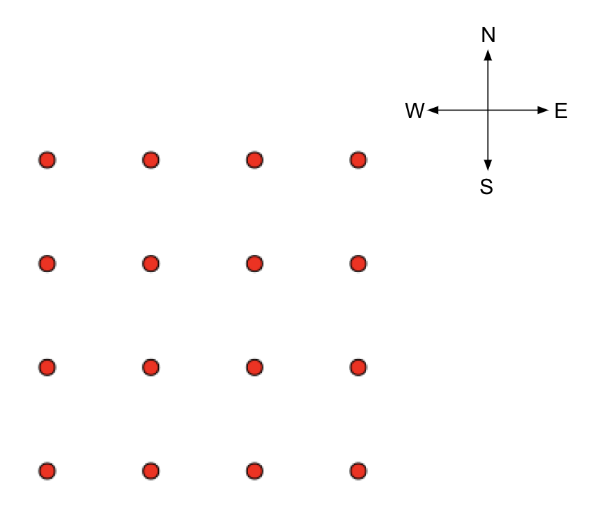

# Nathan Nowack: Projects

<p align="center"></p>

Here is a summary of some projects that I was excited to work on. I've tried to pick material that shows a template of skills that can be applied to a lot of different practical things, even if the examples themselves are a bit abstract.

---

### Bag of Words Classifier (based on EECS 280 project)
#### Background
For this project, we were tasked with creating a forum post classifier with C++ by using a Bag of Words model. I have recreated the functionality of this program in Python for practice (and to avoid violating the Honor Code by posting my actual assignment).

Some csv files with Piazza posts (student-instructor Q&A forum) were provided, containing post labels and content:

| tag | content |
|:---:|:---:|
| exam | in w15 problem 4d when we create base baseptr der does this make an instance of base with value 5|
| image | if youve got your resize program working feel free to share the results with some images of your own|
| recursion | i may have missed this but would we expect to have negative numbers in our liststrees |
|...|...|

During this project we were learning about Binary Search Trees, recursion and maps, so we were required to implement our own search tree and map classes before creating the post classifier. These implementations were pretty slow, so when it came time to write the high-level classifier we used the more efficient standard C++ map/BST structures. In my recreation, I used Python's analogous `dict` class. 

To train our classifier to recognize posts, we used a simplified form of Bayes' conditional probability theory:    

... which is to say the probability a post X has label C is a function of the number of posts that have occurred with label C times some factor representing the likelihood that X has C given the history of associations between the words in the post and post labels.

#### Solution
I created a class for the high-level classifier `Classifier()` with members to store a history of posts, labels, unique words, unique word-label pairs and with member functions to read in and record instances of words with labels in the training data, predict the labels of new posts, and to summarize the results. I used Python's `set()` to avoid adding duplicate items.

I created a class `Post()` representing a single forum post with members for the unique constituent words and the label along with a `Post.has(word)` member function returning a bool if a post has a word. 

Next, I created a function to calculate the log-probability score of all labels for a given based on the classifier map of word-label instances, using Bayes' theorem in the following manner:

log-probability score =   +  

The probability score is the prior value from the number of posts with the label you're calculating plus the contribution of each word in the post. To avoid null values in situations where a word has never been seen before or seen before with a specific label, I conditionally calculate the contribution of each word as shown below:

```python
def log_score(obj, newPost, label):
    num = len(obj.posts)
    bank, labels, pairs = obj.words, obj.labels, obj.pairs
    words = newPost.words
    sum = 0
    for word in words:
        pair = (label, word)
        if word not in bank:
            sum += np.log(1/num)
        elif pair not in pairs:
            sum += np.log(bank[word]/num)
        elif pair in pairs:
            sum += np.log(pairs[pair]/labels[label])
        else:
            print("should never happen")
            assert(False)
    return sum
```
For a single new post unknown to the classifier, the `log_score()` routine runs for each label known to the classifier and select the label giving the largest score, using the classifier predict member function as shown below:
```python
def predict(self, file):
    df = pd.read_csv(file).dropna()
    newPosts = [Post(i, j) for i,j in df.iterrows()]
    prediction = []
    for newPost in newPosts:
        l = {}
        for label in self.labels:
            prior = np.log(self.labels[label]/len(self.posts))
            likelihood = ll(self, newPost, label)
            p = prior + likelihood
            add(label, l, v=p)
        key = max(l, key=l.get)
        pred = (key, newPost.label, key == newPost.label, round(l[key], 1))
        prediction.append(pred)
    self.summarize(prediction)
```
This process is repeated throughout the whole csv of new posts and each time I check to see if the classifier predicted correctly (since the post content was actually labeled). 

I remembering being excited about this because even for a relatively simple Bag of Words model, it correctly matched 2563 of 2959 new posts based on 11,283 training posts, 87% accuracy. This project's source is linked [here](https://github.com/zzstoatzz/portfolio/blob/master/classify.py). 

In the future I want to alter the structure of this project to attack a similar problem (sentiment analysis on Twitter and other platforms using Tweepy / relevant API) while using more of a neural network / stochastic gradient descent correction method to predict more abstract ideas than just post labels. 

### Physics Presentation: Percolation
#### Background
For the physics lab that accompanied Physics 390: Modern Physics (that I took for to complete my physics minor), we had to give a presentation on some active area of particle physics. Since I spent summer 2019 researching percolating networks with my fluids professor, I figured I would give a summary of my work as well as overview of the topic in general. Here is a snapshot of what I learned and created throughout my research and the creation of the presentation.

My professor has spent a great deal of time developing the theory of percolation, or long-range connectivity in networks. This is applied to wide range of studies and research applications, like: [modeling adsorbing and reacting surfaces](https://en.wikipedia.org/wiki/Random_sequential_adsorption), [modeling epidemics](https://en.wikipedia.org/wiki/Epidemic_models_on_lattices), the susceptibility of server networks to localized attacks, and is even used in the development of [more robust natural language processing tehcnologies](https://towardsdatascience.com/intuitive-understanding-of-attention-mechanism-in-deep-learning-6c9482aecf4f). The characteristic value of a network in percolation theory is the critical threshold probability . Which, depending on the regime (site/bond/site-bond), represents the probability of occupying a site or bond that leads to unchecked cluster growth. To put this in (unfortunate) context, the critical percolation threshold of network representing the spread of Coronavirus between people on Earth would be the likelihood of adjacent individuals spreading the virus that leads to every person on Earth becoming infected (neglecting the fact that caution and infection rates are related). 

While I spent a lot of time reading about these different sub-disciplines, I focused most of my time working on networks that are of a transitional dimension (i.e. a really large 2-d network with a very small height).  Naturally, if a randomly evolving network has more dimensions to grow in, long-range connectivity will emerge more quickly for the same 'infection rate' (which is analogous to saying that a virus will spread more quickly if more people are around). We were interested in describing the relationship between percolation threshold values and marginal dimensionality, so I studied  values in increasingly thick network 'slabs'. Here I will show the strict 2-d case for purposes of illustration.

#### Solution
To setup the confines of our network (in the bond percolation regime that I am showing), one can create a "lattice" or system of nodes (also called sites) of a specific size. Programmatically, this can be modeled by a simple 1-d array equal in length to the total number of nodes, as shown by the typical array below:

<p align="center"></p>

One could imagine "chopping" this array into L rows, chopping every L nodes to create an abstract lattice from a simple array. Below is the chopped array, resulting in an abstracted 4x4x1 square lattice (where L = 4):

<p align="center"></p>

Next we have to model the ways in which nodes can interact with each other. In most 2-d models, nodes are limited to interacting with their N, S, E, W "nearest neighbors" and so we can define a list of all the possible bonds that can exist in terms of the vertices these bonds would connect at (each bond you add has to connect at two vertices, so I've represented the list of bonds as a list of vertices necessitated by possible bonds). The following code allows for 3 dimensional systems by including bonds between nodes directly above/below each other in adjacent 2-d layers, but here I'm just talking about a 2-d lattice so the `for z in range(0, WIDTH)` loops won't add any bonds to our list of possible vertices in this case.

```python
# init vertex lists, return iterator (3/2*N) as 'index'
def init_lists(v1, v2):
    index = 0
    for x in range(0, WIDTH):
        for y in range(0, WIDTH):
            for z in range(0, HEIGHT):
                s1 = x + WIDTH*y + WIDTH*WIDTH*z
                s2 = ((x+1)&W) + WIDTH*y + WIDTH*WIDTH*z
                index = connect(v1, v2, s1, s2, index)
                s2 = x + WIDTH*((y+1)&W)+ WIDTH*WIDTH*z
                index = connect(v1, v2, s1, s2, index)
                if (z < HEIGHT-1):
                    s2 = x + WIDTH*y + WIDTH*WIDTH*((z+1)&W)
                    index = connect(v1, v2, s1, s2, index)
                else:
                    s2 = x + WIDTH*y + WIDTH*WIDTH*(0)
                    index = connect(v1, v2, s1, s2, index)
    return index
```
I am using the `WIDTH` of the system as a pre-defined 'jump' within the array, where +/-`WIDTH*y` corresponds to a jump of y rows N or S, while +/- 1 is a movement left or right. In this way, we define all the possible vertices of bonds, connect them:

```python 
def connect(v1, v2, A, B, i):
    v1[i] = A
    v2[i] = B        
    return i + 1
```
and store them in lists that I've called `v1` and `v2`. Now that we have defined all the possible ways in which local connections can appear, it's time to start growing the network!

The evolution of these networks involves a couple interesting pieces of code. First is the `findroot()` routine, which is analogous to a contact tracing algorithm that finds the root node of a cluster, given any node:

```python
# recursive path compression 'find' algorithm
def findroot(i, ptr):
    if ptr[i] < 0: 
        return i
    ptr[i] = findroot(ptr[i], ptr)
    return ptr[i]
```
This is situation is sort of like employees (nodes) acting as agents of companies (clusters) in a quest to merge with the largest company, but only the CEO of each company knows how many employees they have. So if two employees of different companies randomly meet, they would ask their respective superiors how many people are in the company and if that superior doesn't know, they are "pointed" up the chain of command until they get to the CEO. This is the portion of the program referred to as 'path compression' or 'contact-tracing' in epidemiology. 

Once you finally get to the CEO (root node), the company with a smaller workforce (# nodes) would decide to merge with the larger company (cluster). This is the 'union' in widely used 'union-find' algorithms, and my implementation (based on [the work of my professor Robert Ziff and Mark Newman](https://arxiv.org/abs/cond-mat/0101295)) is below:
```python
# union-find routine: bonds connect sites
def cluster(index, lists, big, M2):
    v1, v2, ptr, smax, M2tot, M2minus = lists
    for i in range(0, index):
        r1 = findroot(v1[i], ptr)
        r2 = findroot(v2[i], ptr)
        if (r2 != r1):
            M2 += ptr[r1]*2.0*ptr[r2]
            if ptr[r1] > ptr[r2]:
                ptr[r2] += ptr[r1]
                ptr[r1] = r2
                r1 = r2
            else:
                ptr[r1] += ptr[r2]
                ptr[r2] = r1
            if (-ptr[r1]>big):
                big = -ptr[r1]
        smax[i] += big
        M2tot[i] += M2
        M2minus[i] += (M2 - big*1.0*big)
    return ptr
```
Using `igraph` (which I believe sits on top of `matplotlib.pyplot`) and `ffmpeg` I created and stitched together images of the clusters after each new added bond to show the evolution of the network for widths of 4, 16, 32, and 64 nodes as shown:

<p align="center"></p>

<p align="center"></p>

<p align="center"></p>

<p align="center"></p>

To obtain  from what we've done already, all we need to do is find the inflection point of maximum cluster size against evolution time. However, since this is a stochastic process, we want to find the average inflection point over a large number of network evolutions to determine more precisely where this threshold is. Running the simuation 100 times for `L = 128` and averaging our values, we obtain the logistic curve below (similar to something you would see for number of virus hosts in an extraordinarily reckless society):

<p align="center"></p>

Using a differential calculus Python package `findiff` one can find the inflection point to appear consistently at , very much in agreement with the accepted (analytically determined) [threshold for bond percolation on 2-d sqaure lattices](https://en.wikipedia.org/wiki/Percolation_threshold#Percolation_on_2D_lattices)  

A common theme in percolation theory is to investigate infinite networks and consequently the behaviour of the system near the emergance of an infinite cluster (at the critical probability threshold). Being able to analytically model these systes would allow for characterization of growth and interaction in networks of an arbitrary size. You could imagine that the logistic curve above gets squished in toward the middle as the system gets very large and eventually becomes a step function with a step at the exact point the largest cluster goes from finite to infinite. This is the point of interest, long-range connectivity, the point at which seemingly disparate areas of a network become members of the same cluster.

Computationally, it is impossible to create an infinite array of memory space, but the properties of infinite networks can be reasonably estimated using extrapolating methods developed over years of identifying universal properties of lattices. For example, if one were to ask for critical probability threshold of a infinite 2-d lattice, I could not just set L to infinity and find where an infinite cluster emerges, due to the reality of memory in computers. What I could do is find  for a series of values of L and use the universal constant for 2-d systems  to extrapolate and estimate  of an infinite 2-d lattice as shown below:

<p align="center"></p>

Finding the intercept (corresponding to the limit of  as L goes to infinity) is therefore akin to finding the percolation threshold of an infinite square 2-d lattice!

My value in this case, only running the simulation 100 times, was  . This is a small but significant improvement over critical threshold of the single `L = 128` lattice, an improvement that becomes more significant in larger and more complex networks.
